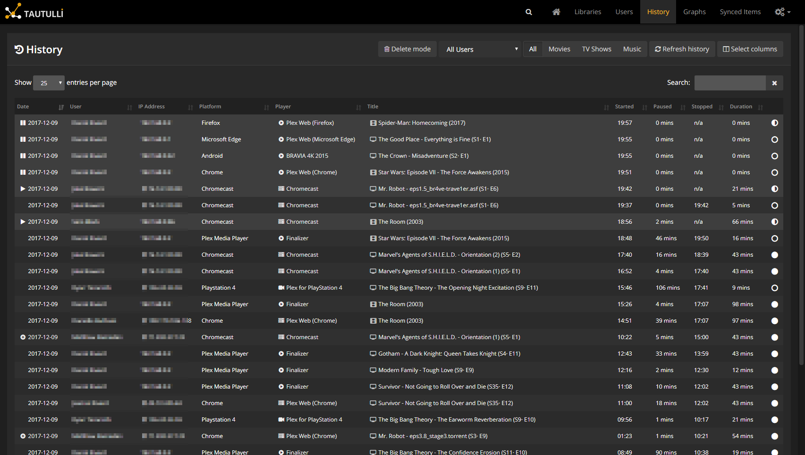

# HTTrack Website Archiver

Welcome back to another documentation article.

This one will cover HTTrack Website Copier.

## Overview:

This open-source software is used to crawl the web and in an offline browser allows you to download the HTML page of that website link, for purposes of archiving or downloading an article off the internet for offline usage.

<figure><figcaption>
Website Homepage
</figcaption></figure>

## Installation Guide via Unraid

For this installation process, it will be quite easy since its already ready with an installation template within the community AppStore. Note: if you would like to use something like portainer with docker instead and use docker-compose I'm pretty sure they have the link to those files on their website.

Firstly, you want to access the community appstore within unraid and search for Httrack and should look something like this.

<figure><figcaption></figcaption></figure>

Once here you can hit action and then install and you will be brought to an installation template page.

<figure><figcaption>
Installation Template via unraid
</figcaption></figure>

In here you can keep it pretty default in terms of settings other then inputting where you want the website archives to be stored which will need to be up to you. Another critical thing I should mention is that, if you run multiple containers within unraid like I do and have a port confliction where another container is using the port this new application is going to use you will run into issues and probably need to redirect which il show how to do here.

<figure><figcaption>
Copier In Progress
</figcaption></figure>
