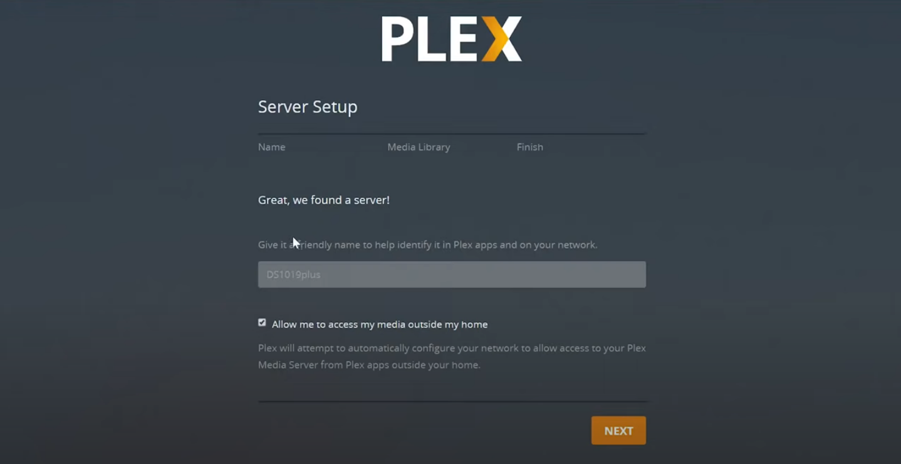

# Plex Media Server

## <mark style="color:red;">Overview:</mark>

Plex is a media streaming service that is client-server side based, in contrast to your traditional streaming platforms like Netflix or Stan. Plex is a self-hosted client and can be used to host/stream the media content you own at home already. The plex software creates a convenience to allow any of your media to be easily streamed to any devices that the plex software supports, within your network or even outside your own home.

<figure><figcaption>
Plex.tv Homepage
</figcaption></figure>

## <mark style="color:red;">Install Guide For Unraid</mark>

This will be a quick guide to explain and briefly show how the installation process looks and works.

Unfortunately, this will be the install guide for the Unraid OS since that's what I'm using at the time.

The download link for the plex media server software for other platforms will be listed below under this guide.

**Since I do talk about transcoding further down in the guide, I thought I would explain what that is in case you are unfamiliar or don't know what that is.**

* <mark style="color:purple;">Transcoding is</mark> <mark style="color:purple;"></mark><mark style="color:purple;">**a digital-to-digital conversion of one type of encoded data (video or audio) to another**</mark><mark style="color:purple;">, often because the target device that will be used to display the content requires a smaller file size.</mark>

### <mark style="color:red;">Search for Plex in Apps</mark>

The first step you want to do in Unraid OS is going to your apps tab and search for "plex".

There will be quite a few that come up from different authors, they all sort of are the same but are different because you need to rely on the author to come up making sure the updates are always being posted out and on time.

Personally, for me I like the one that is authored by the "linuxserver" team, they haven't let me down in the past,  and never had issues with them. But they all will mostly work regardless so if you would like to choose a different one you can by the installation process may differ slightly.

<figure><figcaption>
Search for "Plex" in Apps
</figcaption></figure>

### <mark style="color:red;">Configuring Plex Install</mark>

This next process may get a little tricky and possibly hard to understand some terms or configurations, so best to be patient and bare with me whilst I explain.

<figure><figcaption>
Page 1
</figcaption></figure>

<figure><figcaption>
Page 2
</figcaption></figure>

Most of the configuration here doesn't need to be changed because the default settings will work fine since the authors try to make the installation process easy as possible.&#x20;

Disclaimer\* Any changes I list here would be the only ones recommended to be changed and leave the rest alone.

**Changes List:**

PLEX\_Claim:&#x20;

* This will be your plex token as shown in the photo you will need to go to that link in order to get your token and enter it there.

Transcode:

* Personally, this is optional normally it will by default set it to "/transcode" but by changing it to "/tmp" we can actually move this transcoding process to the ram which can alleviate a lot of pressure on the disk drives.

## <mark style="color:red;">Download Link</mark>

Here you will find the link to download [Plex Media Server](https://www.plex.tv/media-server-downloads/) for yourself to try out! For all platforms: Mac OS, Windows, Docker, Linux, Etc.
