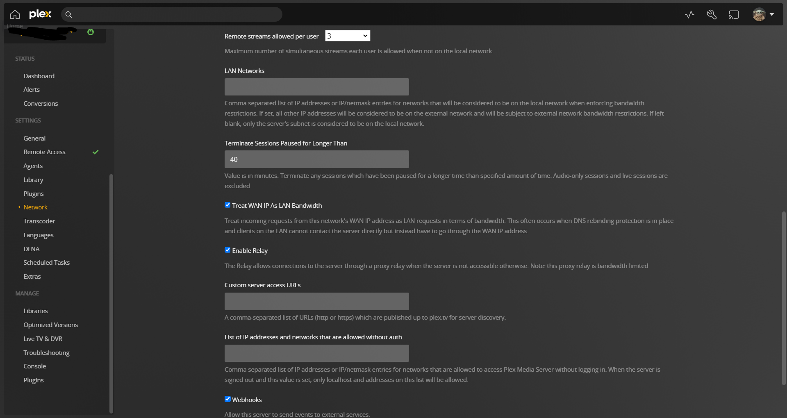

# Plex Media Server

## <mark style="color:red;">Overview:</mark>

Plex is a media streaming service that is client-server side based, in contrast to your traditional streaming platforms like Netflix or Stan. Plex is a self-hosted client and can be used to host/stream the media content you own at home already. The plex software creates a convenience to allow any of your media to be easily streamed to any devices that the plex software supports, within your network or even outside your own home.

<figure><figcaption>
Plex.tv Homepage
</figcaption></figure>

## <mark style="color:red;">Install Guide For Unraid</mark>

This will be a quick guide to explain and briefly show how the installation process looks and works.

Unfortunately, this will be the install guide for the Unraid OS since that's what I'm using at the time.

The download link for the plex media server software for other platforms will be listed below under this guide.

**Since I do talk about transcoding further down in the guide, I thought I would explain what that is in case you are unfamiliar or don't know what that is.**

* <mark style="color:purple;">Transcoding is</mark> <mark style="color:purple;"></mark><mark style="color:purple;">**a digital-to-digital conversion of one type of encoded data (video or audio) to another**</mark><mark style="color:purple;">, often because the target device that will be used to display the content requires a smaller file size.</mark>

### <mark style="color:red;">Search for Plex in Apps</mark>

The first step you want to do in Unraid OS is going to your apps tab and search for "plex".

There will be quite a few that come up from different authors, they all sort of are the same but are different because you need to rely on the author to come up making sure the updates are always being posted out and on time.

Personally, for me I like the one that is authored by the "linuxserver" team, they haven't let me down in the past,  and never had issues with them. But they all will mostly work regardless so if you would like to choose a different one you can by the installation process may differ slightly.

<figure><figcaption>
Search for "Plex" in Apps
</figcaption></figure>

### <mark style="color:red;">Configuring Plex Install</mark>

This next process may get a little tricky and possibly hard to understand some terms or configurations, so best to be patient and bare with me whilst I explain.

<figure><figcaption>
Page 1
</figcaption></figure>

<figure><figcaption>
Page 2
</figcaption></figure>

Most of the configuration here doesn't need to be changed because the default settings will work fine since the authors try to make the installation process easy as possible.&#x20;

Disclaimer\* Any changes I list here would be the only ones recommended to be changed and leave the rest alone.

<mark style="color:purple;">**Changes List:**</mark>

PLEX\_Claim:&#x20;

* This will be your plex token as shown in the photo you will need to go to that link in order to get your token and enter it there.

Media:

* This is where you will be pointing plex to your media. If you select the drop-down you can use it to go in and out of shares to direct them to your main media folder. It's best to point it to a general "media" folder where inside it consists of your media separated into its categories. Eg. TVshows, movies, videos, etc.

Transcode:

* Personally, this is optional normally it will by default set it to "/transcode" but by changing it to "/tmp" we can actually move this transcoding process to the ram which can alleviate a lot of pressure on the disk drives and may increase overall performance.

<mark style="color:purple;">These listed below should be removed to decrease confliction issues:</mark>

* <mark style="color:purple;">Path: /tv:\*</mark>
* <mark style="color:purple;">Path: /movies:\*</mark>
* <mark style="color:purple;">DVB Device: (This one only remove if you don't have a TV Tuner Installed)</mark>

<mark style="color:purple;">They can be removed by simply pressing the remove button next to the field.</mark>

Appdata:

* You can leave this by default to what it has preset as I have done, but if you would like it in a separate spot or move it elsewhere this is the field you want to be changing. This is where the data files for the container/application will live.

Once you have done and reviewed all these, you can press "apply" and let the install run until it says to exit out.

### <mark style="color:red;">Running Plex First Time</mark>

Once the installation is completed you will want to go to your "docker" tab and find plex proceed to click and select WebUI, where it will take you through the plex media server setup guide to getting your plex online and reading your media.

<figure><figcaption>
Plex within docker
</figcaption></figure>

Once you head over to the plex WebUI it may ask you to sign in, in which case you should also create and sign in with a plex account if you haven't already created one. Once that is done you will head over to a screen something like this.

<figure><figcaption>
Plex server setup
</figcaption></figure>

Here you will want to name your server, you can leave it with the name it has given you but it's preferred to make it something of your own choosing. <mark style="color:purple;">If you want to be able to access your media remotely outside your house via the plex app on your chosen device, keep the tick box ticked for "Allow me to access my media outside my home".</mark> After this click "next".

<figure><figcaption></figcaption></figure>

<figure><figcaption></figcaption></figure>

Once you hit these screens here you are basically letting plex know what media type you are adding and where the media is located. This is where we give it the specific location for that type of media, <mark style="color:purple;">not the same general location as in the unraid plex config setup</mark>.&#x20;

Once you have finished adding all your media in and clicking "next". You're pretty much done it will take you to your homepage and start attaching metadata to your content and allow you to now gain watch/streaming access to your content from your unraid server. Feel free to look around and go into settings and get a feel for what plex is all about!

## [Follow Up Settings](follow-up-settings.md)

This isn't critical to the setup but can help make performance better and you probably better off going through this to make plex as optimal as it can be. Click above if you wanna continue.

## <mark style="color:red;">Download Link</mark>

Here you will find the link to download [Plex Media Server](https://www.plex.tv/media-server-downloads/) for yourself to try out! For all platforms: Mac OS, Windows, Docker, Linux, Etc.
