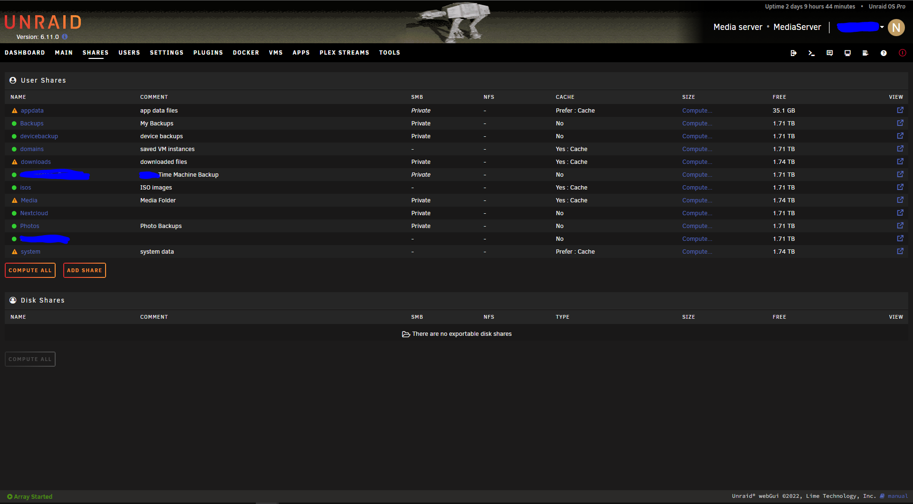

# Unraid OS

## Overview:

Unraid is a Linux based operating system created for media aficionados, gamers, data pursuers, and other intensive data-users to have the ultimate control over their data, media, applications and desktops whilst using any sort of hardware combination.

<figure><figcaption>
Unraid Product Page
</figcaption></figure>

## Unraid Home Page

<figure><figcaption>
Unraid Homepage
</figcaption></figure>

Unraid Home page is where most of the performance, monitoring and general overview of your unraid server can be seen.

You can see your CPU, Motherboard, Ram and Storage usages and monitoring here on the left and right.&#x20;

Unraid uses something called an "array" where it puts all the storage disks into type of raid where it becomes depenant on each other and writes everything to the parity drive. Array works little different to your typical raid in which it will also write everything thats on the array to the parity drive to almost mirror every other drive in case of an instance that one drive fails that drive can rebuild that drive or become in replace of the failed drive.

Cache drive can also be used, normally done with an ssd to help transfer speeds of data coming on and off the array and sometimes also hold data in its self for usage.

In the middle column you will find all the containers, virtual machines and shares that have been created. Most of these windows/widgets can be customised and moved around to your likeing.

If you are interested in downloading you can download [here](https://unraid.net/download)! and follow the guide to install!
