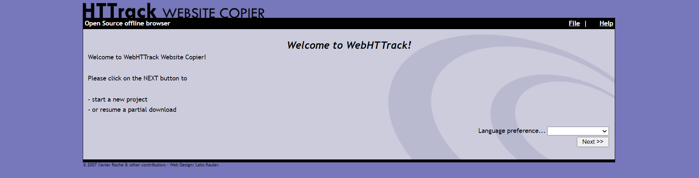

# Example YAML configs

## <mark style="color:red;">Overall Example of dashboard:</mark>

<figure><figcaption>
Example Dashboard
</figcaption></figure>

<mark style="color:purple;">These are the seperate yaml file examples that made up this dashboard. These can be edited and used with your own configuration to be able to use these services.</mark>

## <mark style="color:red;">Services.yaml:</mark>

### <mark style="color:red;">Example Dashboard:</mark>

<figure><figcaption>
Example Services
</figcaption></figure>

### <mark style="color:red;">Code:</mark>

`Media Monitoring:`

* `Plex:`
  * `icon: plex.png`
  * `href: YOURIPADDRESS:PORT`
  * `description: Home Media steaming`
  * `widget:`
    * `type: plex`
    * `url: YOURIPADDRESS:PORT`
    * `key: yourplexkey`
* `Sonarr:`
  * `icon: sonarr.png`
  * `href: YOURIPADDRESS:PORT`
  * `description: Series Management`
  * `widget:`
    * `type: sonarr`
    * `url: YOURIPADDRESS:PORT`
    * `key: Your Sonarr API KEY`
* `Radarr:`
  * `icon: radarr.png`
  * `href: YOURIPADDRESS:PORT`
  * `description: Movies Management`
* `Bazarr:`
  * `icon: bazarr.png`
  * `href: YOURIPADDRESS:PORT`
  * `description: Subtitle Manager`
* `Tautulli:`
  * `icon: tautulli.png`
  * `href: YOURIPADDRESS:PORT`
  * `description: Plex Monitoring`&#x20;
  * `widget:`
    * `type: tautulli`
    * `url: YOURIPADDRESS:PORT`
    * `key: Your tautulli API Key`
* `Overseerr:`
  * `icon: overseerr.png`
  * `href: YOURIPADDRESS:PORT`
  * `description: Media Requests`

`Torrents and Files:`

* `NZBGet:`
  * `icon: nzbget.png`
  * `href: YOURIPADDRESS:PORT`
  * `description: Usetnet Downloader`
* `Deluge:`
  * `icon: deluge.png`
  * `href: YOURIPADDRESS:PORT`
  * `description: Deluge Downloader`
* `qbitorrent:`
  * `icon: https://upload.wikimedia.org/wikipedia/commons/6/66/New_qBittorrent_Logo.svg`
  * `href: YOURIPADDRESS:PORT`
  * `description: Qbitorrent Downloader`

`Game Servers:`

* `Minecraft Server:`
  * `icon: minecraft.png`
  * `href: YOURIPADDRESS:PORT`
  * `description: Minecraft Server Manager`

`Utilities:`

* `Backup:`
  * `icon: https://cdn-icons-png.flaticon.com/128/8847/8847144.png`
  * `href: YOURIPADDRESS:PORT`
  * `description: Backup Software Manager`
* `P-Stash:`
  * `icon: https://t3.ftcdn.net/jpg/01/11/34/88/240_F_111348852_LsBHJVidnwHqlY4W1O1aFQuLUAMqZtEk.jpg`
  * `href: YOURIPADDRESS:PORT`
  * `description: P Stash`

`My Network Management:`

* `PFSense:`
  * `icon: pfsense.png`
  * `href: YOURIPADDRESS:PORT`
  * `description: PfSense Router`
* `Netgear Switch:`
  * `icon: https://cdn-icons-png.flaticon.com/512/2248/2248677.png`
  * `href: YOURIPADDRESS:PORT`
  * `description: Netgear Switch`
* `Tp-link Access Point:`
  * `icon: https://cdn-icons-png.flaticon.com/128/2876/2876882.png`
  * `href: YOURIPADDRESS:PORT`
  * `description: Tp-link Access Point`
* `Unraid Server:`
  * `icon: unraid.png`
  * `href: YOURIPADDRESS:PORT`
  * `description: Unraid Server`
* `Pi-Hole:`
  * `icon: https://cdn-icons-png.flaticon.com/512/5969/5969184.png`
  * `href: YOURIPADDRESS:PORT`
  * `description: Pi-Hole`
* `NginxProxyManager:`
  * `icon: https://nginxproxymanager.com/icon.png`
  * `href: YOURIPADDRESS:PORT`
  * `description: NginxProxyManager`

## <mark style="color:red;">Widgets.yaml</mark>

### <mark style="color:red;">Example Dashboard:</mark>

<figure><figcaption>
Example Widgets
</figcaption></figure>

### <mark style="color:red;">Code:</mark>

`resources:`

* `label: System Performance`
* `cpu: true memory: true`

`resources:`

* `label: Storage`
* `disk: /mnt/storage`

`weatherapi:`

* `label: Your location # optional`
* `latitude: -33.732819`
* `longitude: 151.00496`
* `units: metric`
* `apiKey: 5cbb6cae30e6452ab4f130401220311`
* `cache: 5 # Time in minutes to cache API responses, to stay within limits`

`datetime:`

* `text_size: x1`
* `format:`
  * `timeStyle: short`
  * `hour12: true`
  * `dateStyle: short`

`search:`

* `provider: google`&#x20;
* `target: _blank`

<mark style="color:red;"></mark>
