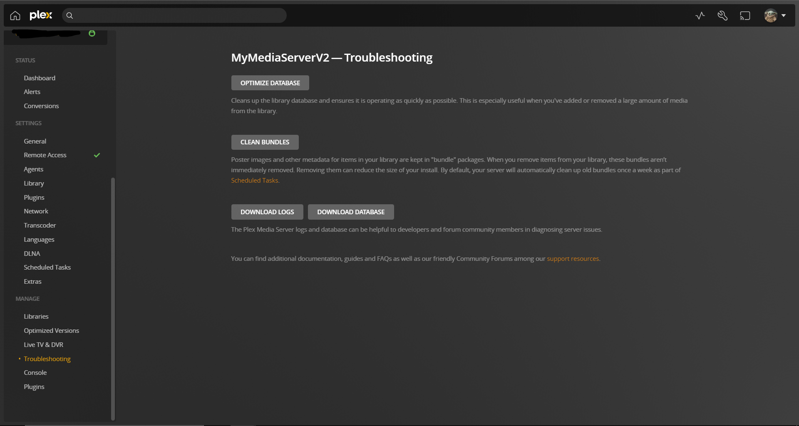

# Follow Up Settings

Before we get into the follow-up settings, I should advise you have a quick look at this [tips and tricks article](https://imgur.com/a/QAUFN13) made for plex. It's quite easy to follow and probably best to make these changes. You might find some stuff in the article overlap, which is fine you can just skip it.

## <mark style="color:red;">Web Video Quality</mark>

<figure><figcaption></figcaption></figure>

You want to be making sure for optimal streaming quality that the "video quality" is set to maximum and tick the play smaller videos at original quality. These settings will also need to be adjusted to the same per device and user/account since it will be a preference setting to you alone and everyone else will by default have the preset default settings selected.

## <mark style="color:red;">Plex Dashboard</mark>

<figure><figcaption></figcaption></figure>

Plex dashboard is where all the general information about what is going on with your plex media server is going to be. Information about current real-time media being played/streamed, stats about bandwidth, CPU, ram, storage, stats on user viewing, and most viewed content.

## <mark style="color:red;">Remote Access</mark>

<figure><figcaption></figcaption></figure>

Remote access is where the configuration for sending/allowing your media to be viewed outside of your network/house. Normally this is preconfigured and by default will be able to work out of the box, once enabled by the plex server owner.&#x20;

Sometimes there may also be problems where it can't reach outside the network. That's when you may need to configure port forwarding with plex on your home network router and or also configure a specific port also if you would like. That part is optional (Manual Port) since plex already has predefined port numbers can you can just enter them into your port forwarding rules on your router.

## <mark style="color:red;">Library</mark>

<figure><figcaption></figcaption></figure>

<figure><figcaption></figcaption></figure>

These settings here are to do with your media library can be adusted around your personal preference and liking. These are my personal opinion selections and find that they give me the best overall experience.

## <mark style="color:red;">Network</mark>

<figure><figcaption></figcaption></figure>

<figure><figcaption></figcaption></figure>

Most of the settings within here won't need to be messed with, except a few.&#x20;

Remote Streams Allowed Per User:

* This option here will allow you to adjust how many people outside the network can stream your media. In case for some reason, streams are using too much of your home network bandwidth you can adjust the number of people that can stream at once.

Terminate Sessions Paused for Longer Than:

* This one here also is optional but I quite like it since some people will leave their streams on pause and will forget to close them. When this happens plex still thinks your watching it so it will continue to use resources to buffer the video and put effort into that stream when it could be put elsewhere.

Enable Relay:

* I would also advise keeping this ticked. Sometimes when remote access is enabled and plex finds it difficult to send a direct stream out from your router it will actually reroute it through plex's servers to your device in a 3-way triangle connection. <mark style="color:purple;">Keeping this enabled ensures you will always have remote access outside of your network.</mark>

You can also add in manualy IP addresses if you only want plex to be able to be accessed by certain IP-addressed devices within the network.

## <mark style="color:red;">Transcoder</mark>

<figure><figcaption></figcaption></figure>

This place is for the transcoder setup, this will be activated when content/media needs to be transcoded because a device either not supporting the format or can't buffer the quality for viewing.

These will probably be the best settings for you to you use with a few exceptions that can be changed based on the hardware you running within your unraid server.&#x20;

Transcoder default throttle buffer:

* This can be adjusted to a smaller figure but the higher the number it will help prepare the video for the viewer, but isn't crucial for fluid streaming.

Maximum video transcodes:

* This setting is for restricting the number of devices that can have transcoding content being streamed to it. Depending on the hardware it can bottleneck and cause overall performance issues, so it's recommended to test and find a nice number that doesn't cause too many issues with your overall machine.

## <mark style="color:red;">Scheduled Tasks</mark>

<figure><figcaption></figcaption></figure>

This one has to do with more preset tasks that plex will run for you but now allows for more customisation as to when these will occur.

These are my recommendations to keep plex running fluidly but also these are again up to the personal preference of the server owner and how they wanna run their media.

## <mark style="color:red;">Libraries</mark>

<figure><figcaption></figcaption></figure>

This is where your library categories live and display how they will be structured on the plex homepage and for your client/viewers. Within each you can adjust different categories for each type of media.&#x20;

Eg.

* Movies can have different categories genre, year created, author, director, actors, etc.

You can then take these "categories and drag and drop" them around in order of how you want them to be displayed. This is again personal preference, and probably best for you to further look yourself to fully understand how much customisation there can be.&#x20;

<mark style="color:purple;">Il add in here, I have created an article blog on</mark> ["Plex Meta Manager"](https://app.gitbook.com/o/UlTmFaF7PSfhBNuKtcaC/s/XhEyf0WtMngrQlcUAQw6/)<mark style="color:purple;">, this is a really good application and can also automate a lot of the categories by creating a script that can:</mark>

* <mark style="color:purple;">auto add categories based on any filters you like</mark>
* <mark style="color:purple;">playlists from online</mark>
* <mark style="color:purple;">adding certain thumbnails to shows or movies</mark>
* <mark style="color:purple;">etc.</mark>

<mark style="color:purple;"></mark>
